# Leaf Disease Classification System

This document outlines the architecture of a complete, multi-phase system for identifying and classifying diseases in hydroponically grown leafy greens. Using a cascade of deep learning models, the system first identifies the crop, then assesses its health, and finally pinpoints the specific disease and its location on the leaf.

## ✨ Features

* **Multi-Phase Classification**: A robust, sequential pipeline ensures accurate and detailed analysis.
* **Leaf Validation**: An initial check to ensure the input image is actually a leaf.
* **Crop Identification**: Classifies common hydroponic crops.
* **Health Assessment**: Differentiates between healthy and diseased leaves.
* **Disease Localization**: Detects and draws bounding boxes around affected areas.

## 🏗️ System Architecture

The system employs a sequential, four-phase pipeline designed for detailed and accurate analysis of leaf health. An image progresses through the stages only if it meets the criteria of the preceding phase, ensuring that computational resources are used efficiently. This hierarchical approach allows the system to move from a general assessment to a highly specific diagnosis.

```mermaid
graph TD
    subgraph "Input"
        A[📸 Image]
    end

    subgraph "Phase 0: Leaf Validation"
        H{Leaf or Not-Leaf Classification}
    end

    subgraph "Phase 1: Crop Identification"
        B{Crop Type Classification}
    end

    subgraph "Phase 2: Health Assessment"
        C{Health Status Classification}
        D{Is the leaf diseased?}
    end

    subgraph "Phase 3: Disease Analysis"
        F{Disease Detection & Localization}
    end

    subgraph "Output"
        I[❌ Not a Leaf]
        E[✅ Healthy Leaf]
        G[🦠 Diseased Leaf with Bounding Box]
    end

    A --> H
    H -- Leaf --> B
    H -- Not-Leaf --> I
    B --> C
    C --> D
    D -- Yes --> F
    D -- No --> E
    F --> G
```

### Architectural Breakdown

**Phase 0: Leaf Validation**
This initial phase acts as a gatekeeper for the entire system. Its primary function is to verify that the input image actually contains a leaf.

* **Process**: The system receives an image and performs a binary classification.
* **Outcome**: If the image is classified as a leaf, it is passed to the next stage. If not, the process terminates immediately, and the input is flagged as "Not a Leaf." This crucial first step prevents the pipeline from processing irrelevant images, saving valuable time and resources.

**Phase 1: Crop Identification**
Once an image has been validated as a leaf, this phase determines the specific type of crop.

* **Process**: The leaf image is fed into a multi-class classification model. This model is trained to distinguish between various types of hydroponic plants (e.g., lettuce, spinach).
* **Outcome**: The identified crop type is attached to the image as metadata and passed to the next phase. Knowing the crop type is essential, as different plants are susceptible to different diseases and have unique visual characteristics.

**Phase 2: Health Assessment**
With the crop type identified, this phase performs a general health check on the leaf.

* **Process**: The system uses another classification model to determine if the leaf is "Healthy" or "Diseased." This assessment can be tailored based on the crop type identified in the previous phase, allowing for a more accurate diagnosis.
* **Outcome**: If the leaf is deemed "Healthy," the analysis concludes, and the result is reported. If the leaf is classified as "Diseased," it is forwarded to the final, most intensive phase of the pipeline.

**Phase 3: Disease Analysis & Localization**
This is the final and most granular stage of the system, activated only for leaves confirmed to be diseased.

* **Process**: An advanced object detection model scans the image to identify and locate specific diseases. It is trained to recognize the visual signatures of various common plant ailments.
* **Outcome**: The final output includes the name of the specific disease(s) detected. Furthermore, it provides the precise coordinates for bounding boxes that are drawn around the affected areas of the leaf. This delivers a clear, actionable diagnosis that can be used for targeted treatment.
